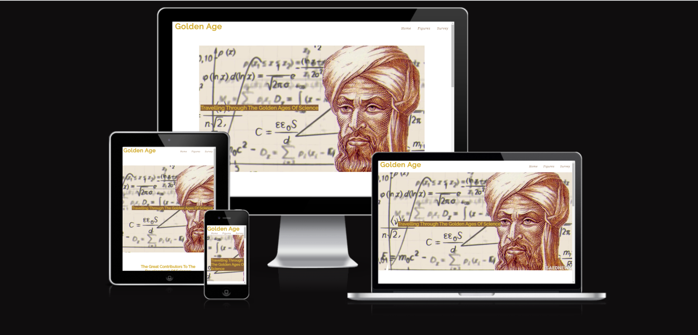
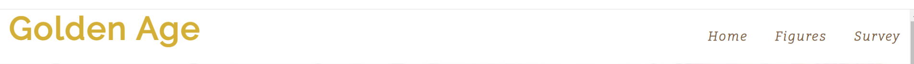
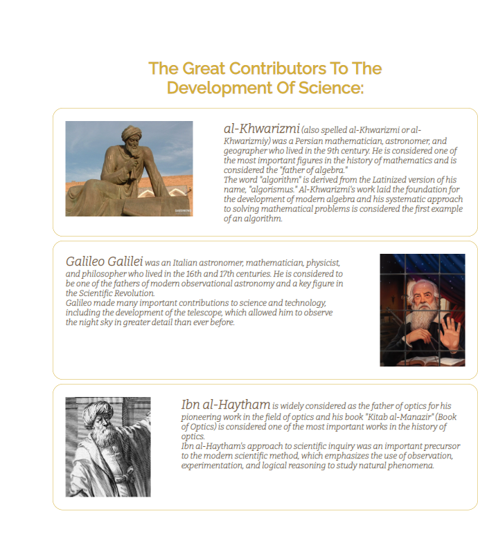
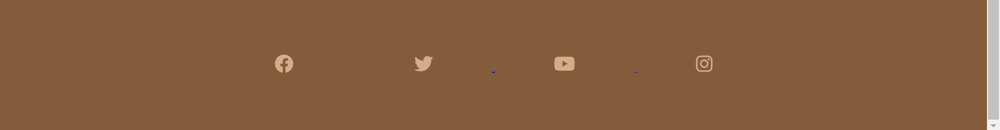
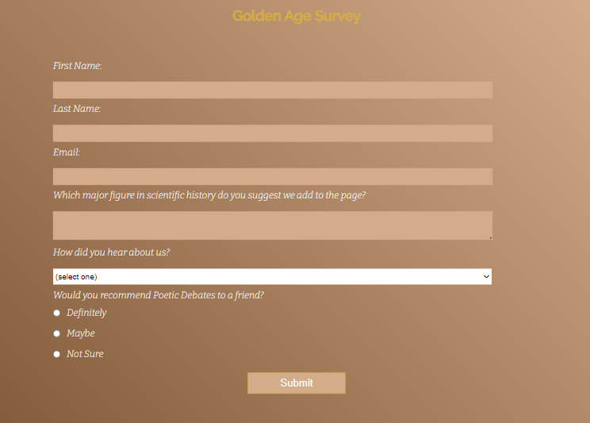
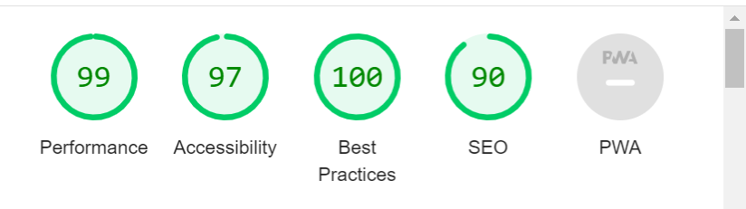

# Golden Age

The <a href="https://jibab96.github.io/Golden-Age-Page-/">Golden Age</a> website is desined to give the user the experience of traveling through different time periods where great scientific discoveries were made.
The Golden Age site aims to find major figures in scientific history from all regions and times, giving them their flowers while also giving the user information on their contribution to scientific history. This website has been designed to be responsive on all webpages.

## User Experience (UX)
### Key information for the site
The website is designed to give brief summaries on integral figures in the development of science. The survey page on the website is designed to help the webpage grow, as different people from different backgrounds can request for major figures in scientific history to be featured on the website.
### User Stories
#### Client Goals
<li>To be able to acces the website on different devices</li>
<li>To make it easy for users to see the websites goals</li>
<li>To make it clear what major figures in the history of science we are currently featuring</li>
<li>For users to be able to contribute to the website by suggesting major figures to be featured on the website</li>

### First Time Visitors Goals
<li>To be able to find out what the page is about</li>
<li>To be able to navigate through the website</li>
<li>To be able to find the social media connection</li>

### Returning Visitor Goals
<li>I want to be to see new figures that have contributed to the development of science</li>
<li>I want to be able to make new suggestions for major figures in the develpopment of science</li>

### Frequent Visitor Goals
<li>I want to keep making suggestions of major figures and see updated figures on the page</li>

## Design 

### Colour Scheme
The colors I used are based on the hero image being brown and the name including golden. These colors include: #835c3b, #D3AC8B, #d4af37 and #F7F9F9.

### Typography
I used two google fonts that are considered a pair, which are:
<li>Raleway is used for headings to give a formal look</li>
<li>Bitter is used for the body text on the website as it pairs well with Raleway.</li> 

### Imagery
The images I use in the website are from different sources credited in the credits section.
## Features

### Navigation
The logo is featured at the top left hand side of the page. The color of the logo relates to the name of the web page. The Raleway font is used to make it look formal.

The navigation featured on the right hand side navigates to the landing page (Home), the historical figures (Figures) and the survey page (Survey). The brown color is used as it goes well with the hero image used.

### Hero Image

The hero image shows one of the major figures in scientific history, who is also featured in the page (al-Khwarizmi), with a background showing some calculations.
The cover text explains what the website main objective and what the user experience should be.
The image gives a clear indication as to what the website is about.

### Figures

 The figures section shows the great people involved in the development of science.
It keeps with the golden theme of the website.

### Footer

The footer section shows the social medial links using font awesome icons. They also have a hover feature. The footer was inspired by the love running website. 

### Survey

 The survey form serves the purpose to grow the website and to get some user input.
The background color keeps with brown theme.
This makes the user feel that they are a part of the website.

## Accessibility
I've been careful to try to make this website ass accessible as possible. I've done this by:
<li>Ensuring that I use the correct semantic HTML,</li>
<li>Using alt attributes on images that are descriptive,</li>
<li>Using the aria-label attribute when using icons,</li>
<li>By using colors that have strong contrast.</li>

## Technologies Used

I used HTML and CSS to create this website.

The programs I used include:
<li>GitHub - To store files for the website,</li>
<li>Git - for version control,</li>
<li>Google fonts - To import the font I use on the website,</li>
<li>Font Awesome - for the icons used on this website,</li>
<li>Google Dev tools - To find and resolve issues with styling. Also to used the Lighthouse feature,</li>
<li>Am I Responsive - To show the website images on different sized devices.</li>

## Deployment & Local Deployment

### Deploymment
I used GitHub Pages to deploy the website. This is how I did it:
<ol>
<li>I logged in to GitHub.</li>
<li>I went to the repository for this project, Golden Age Page.</li>
<li>I went to the settings menu.</li>
<li>I clicked on the Pages tab on the navigation bar.</li>
<li>I found the Source section, then choose main from the drop down select branch menu. I then selected the Root from the drop down select folder menu.
</li>
<li>I then saved it and revieved a URL with the site deployed.</li>
 </ol><a href="https://jibab96.github.io/Golden-Age-Page-/index.html">Golden Age</a>

 ### Local Deployment
Inorder to Fork the Golden Age Page repository I logged into GitHub, then found the Golden Age repository and then clicked on the Fork button.
 For me to Clone the Golden Age page I logged in to GitHub, went to the repository for this project.
I then clicked on the code button, selected whether I would like to clone with HTTPS, SSH or GitHub CLI and copied the link shown.
I opened the terminal in my code editor and changed the current working directory to the location I wanted to use for the cloned directory. I then typed git clone into the terminal and then pasted the link I copied earlier.

## Testing

 I tested the page using different browsers including: Google Chrome, Firefox and Safari.
 I loaded the page on different screen sizes to make sure it is responsive, aesthetically please and fucntioning.
 I also made sure that font-sizes and colors are readable.
 I did some trial runs to make sure the form is functioning in the way it is expected in standard practice.

## Bugs
I had no bugs when deploying the website as I kept previewing the page and fixing any mistakes such as typos and css problems.

## Validator Testing
<ul>
 <li>HTML - I used the official W3C validator and found no errors,</li>
 <li>CSS - I used the official Jigsaw validator and found no errors,</li>
 <li>I ran the project through the lighthouse in devtools and found that my accessibilty rating was high.</li>
 
 </ul>

 ## Unfixed Bugs
No unfixed bugs have been found.

## Credits
The hero image was sourced from <a href="https://saednews.com/en/post/muhammad-ibn-musa-al-khawarizmi-algorithmi-mathematical-genius-and-founder-of-algebra"> Saed News </a>
  The image for the al-Khwarimi statue in the figures section was also sourced from<a href="https://saednews.com/en/post/muhammad-ibn-musa-al-khawarizmi-algorithmi-mathematical-genius-and-founder-of-algebra"> Saed News </a>
 
The image for the picture of Galileo in the figures section was sourced from <a href="https://www.scientificamerican.com/article/galileos-lessons-for-living-and-working-through-a-plague/">Scientific American</a>
 
The image for the picture of ibn al-Haytham was sourced from his <a href="https://en.wikipedia.org/wiki/Ibn_al-Haytham">Wikipedia</a> page.
 
The code for the social media links in the footer was taken from the <a href="https://jibab96.github.io/love-running-walkthrough/">Love Running </a> project
