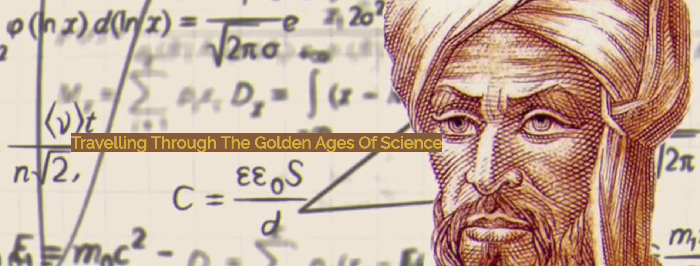

# Golden Age

The Golden Age website is desined to give the user the experience of traveling through different time periods where great scientific discoveries were made.
The Golden Age site aims to find major figures in scientific history from all regions and times, giving them their flowers while also giving the user information on their contribution to scientific history. This website has been designed to be responsive on all webpages.

## User Experience (UX)
### Key information for the site
The website is designed to give brief summaries on integral figures in the development of science. The survey page on the website is designed to help the webpage grow, as different people from different backgrounds can request for major figures in scientific history to be featured on the website.
### User Stories
#### Client Goals
<li>To be able to acces the website on different devices</li>
<li>To make it easy for users to see the websites goals</li>
<li>To make it clear what major figures in the history of science we are currently featuring</li>
<li>For users to be able to contribute to the website by suggesting major figures to be featured on the website</li>

### First Time Visitors Goals
<li>To be able to find out what the page is about</li>
<li>To be able to navigate through the website</li>
<li>To be able to find the social media connection</li>

### Returning Visitor Goals
<li>I want to be to see new figures that have contributed to the development of science</li>
<li>I want to be able to make new suggestions for major figures in the develpopment of science</li>

### Frequent Visitor Goals
<li>I want to keep making suggestions of major figures and see updated figures on the page</li>

## Design 

### Colour Scheme
The colors I used are based on the hero image being brown and the name including golden. These colors include. These colors include: #835c3b, #D3AC8B, #d4af37 and #F7F9F9.

### Typography
I used two google fonts that are considered a pair, which are:
<li>Raleway is used for headings to give a formal look</li>
<li>Bitter as used for the body text on the website as it pairs well with Raleway.</li> 

### Imagery
The images I use in the website are from different sources credited in the credits section.
## Features

### Navigation
The logo is featured at the top left hand side of the page. The color of the logo relates to the name of the web page. The Raleway font is used to make it look formal.

The navigation featured on the right hand side navigates the landging page (Home), the historical figures (Figures) and the survey page (Survey). The brown color is used as it goes well with the hero image used.

### Hero Image

The hero image shows one of the major figures in scientific history, who is also featured in the page (al-Khwarizmi), with a background showing some calculations.
The cover text explains what th website main objective and what the user experience should be.
The image gives a clear indication as to what the website is about.

### Figures

The figures section shows the great people involved in the development of science.
It keeps with the golden theme of the website.

### Footer

The footer section shows the social medial links using font awesome icons. They also have a hover feature. The footer was inspired by the love running website. 

### Survey

The survey form serves the purpose to grow the website and to get some user input.
The background color keeps with brown theme.
This makes the user feel that they are a part of the website.

## Testing

I tested the page using different browsers including: Google Chrome, Firefox and Safari.
I loaded the page on different screen sizes to make sure it is responsive, aesthetically please and fucntioning.
I also made sure that font-sizes and colors are readable.
I did some trial runs to make sure the form is functioning in the way it is expected in standard practice.

## Bugs
I had no bugs when deploying the website as I kept previewing the page and fixing any mistakes such as typos and css problems.

## Validator Testing
<ul>
 <li>HTML - I used the official W3C validator and found no errors.</li>
 <li>CSS - I used the official Jigsaw validator and found no errors</li>
 <li>I ran the project through the lighthouse in devtools and found to my accessibilty rating was high</li>
 
 </ul>

 ## Unfixed Bugs
No unfixed bugs have been found.

## Deployment
 I deployed the site using GitHub Pages.
 I found this in the settings of my GitHub repository, the pages tab leads you to a page where you can deploy your website.
<a href="https://jibab96.github.io/Golden-Age-Page-/index.html">Golden Age</a>

## Credits
The hero image was sourced from <a href="https://saednews.com/en/post/muhammad-ibn-musa-al-khawarizmi-algorithmi-mathematical-genius-and-founder-of-algebra"> Saed News </a>
 
The code for the social media links in the footer was taken from the <a href="https://jibab96.github.io/love-running-walkthrough/">Love Running </a> project
